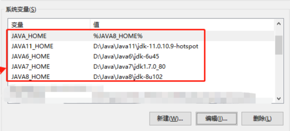
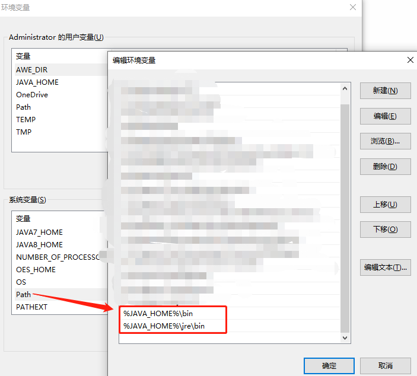

# Java-Version-Switch


系统中安装了多 JDK 版本，每次在系统属性中手动修改 Java 版本太过麻烦，探索到一种简单优雅的快速切换 Java 版本的方法。


## 目标

```
sw [JavaVersion]
eg: sw 7  # 切换到 Java7
```


## 思路

使用 sw.exe 调用 bat 脚本实现 jdk 版本切换.

直接修改系统环境变量，使修改永久生效


## 前置准备

安装 JDK 环境，目录结构如下：

```
Java
├── Java11
│   └── jdk-11.0.10.9-hotspot
├── Java6
│   ├── jdk-6u45
│   └── jre-6u45
├── Java7
│   ├── jdk1.7.0_80
│   └── jre1.7.0_80
├── Java8
│   ├── jdk-8u102
│   └── jre-8u102
├── JavaSwitch
    └── sw.bat
```

环境变量配置：

> 系统变量添加



> Path添加




## 脚本编写

sw.bat

```bat
@echo off
set switch=%1%
rem echo %switch%

if %switch% == 8 (
	echo [*]Switch to Java8.
	setx JAVA_HOME "%%JAVA8_HOME%%" /m
) else (
if %switch% == 7 (
	echo [*]Switch to Java7.
	setx JAVA_HOME "%%JAVA7_HOME%%" /m
) else (
if %switch% == 11 (
	echo [*]Switch to Java11.
	setx JAVA_HOME "%%JAVA11_HOME%%" /m
) else (
if %switch% == 6 (
	echo [*]Switch to Java6.
	setx JAVA_HOME "%%JAVA6_HOME%%" /m
))))

rem pause
```


sw.c

```c
#include "stdio.h"
#include "stdlib.h"

void main(int argc, char *argv[])
{
    int ver = atoi(argv[1]);
    if (argc == 2) {
        char cmd[64];
        switch(ver) {
            case 6:
            case 7:
            case 8:
            case 11:
            sprintf(cmd, "D:/Java/JavaSwitch/sw.bat %d", ver);
            system(cmd);
        default:
        	printf("[*] Only Support 6/7/8/11\n");
        return;
        }
    } else if (argc >= 2) {
        printf("[-] Too many arguments.\n[*] see: sw ?");
    } else {
        printf("[*] Please input Java_Version...\n[*] eg:sw 6/7/8/11\n");
    }
 }

```

编译

```
gcc sw.c -o sw.exe
```

添加环境变量（或直接修改环境变量）

```
C:\Windows\System32\sw.exe  # 直接扔进 C:\Windows\System32 了
```


## 使用

切换版本

```
>java -version
java version "1.7.0_80"
Java(TM) SE Runtime Environment (build 1.7.0_80-b15)
Java HotSpot(TM) 64-Bit Server VM (build 24.80-b11, mixed mode)

>sw 8
[*]Switch to Java8.

成功: 指定的值已得到保存。
[*] Only Support 6/7/8/11
```

重启dos窗口生效

```
>java -version
java version "1.8.0_102"
Java(TM) SE Runtime Environment (build 1.8.0_102-b14)
Java HotSpot(TM) 64-Bit Server VM (build 25.102-b14, mixed mode)
```


